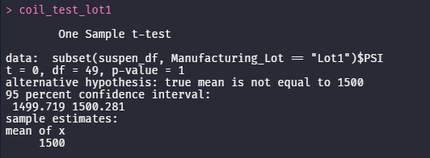

# MechaCar Statistical Analysis

## Linear Regression to Predict MPG

* Which variables/coefficients provided a non-random amount of variance to the mpg values in the dataset?
    - Both vehicle_length and ground_clearance have p value significantly less than .05 which indications a non-random amount of variance.
* Is the slope of the linear model considered to be zero? Why or why not?
    - No, because this models p-value is 5.35e-11 which is significantly less than .05. This is sufficient to reject the null hypothesis, as such the slope is not zero.
* Does this linear model predict mpg of MechaCar prototypes effectively? Why or why not?
    - Yes, the r-squared was 0.7149 and the p-value is 5.35e-11

## Summary Statistics on Suspension Coils

* The design specifications for the MechaCar suspension coils dictate that the variance of the suspension coils must not exceed 100 pounds per square inch. Does the current manufacturing data meet this design specification for all manufacturing lots in total and each lot individually? Why or why not?
    -  When viewing the data as a whole in the we can see that the variance is approximatly 62 psi. This is well within the 100 psi maximum. 
    - When grouped into lots we can see that lot 1 and 2 achieve the design specifications but lot 3 exceeds the 100 psi maxium with a variance of approximatly 170 psi

## T-Tests on Suspension Coils

### As a whole

The p-value is .06 which is larger than the .05 significance level. The data is statistically similar.

### Lot 1

The p-value is 1 which is larger than the .05 significance level. The data is statistically similar.

### Lot 2

The p-value is .6 which is larger than the .05 significance level. The data is statistically similar.

### Lot 3

The p-value is .04 which is smaller than the .05 significance level. The data is not statistically similar.

## Study Design: MechaCar vs Competition

*A statistical study that can quantify how the MechaCar performs against the competition.*

* What metric or metrics are you going to test?
    - cost
    - city fuel efficiency
    - highway fuel efficiency
    - horse power
    - maintenance cost
    - safety rating
* What is the null hypothesis or alternative hypothesis? 
    - There is no significant difference between the MechaCar Prototype and its competition.
* What statistical test would you use to test the hypothesis? And why? 
    - Multiple linear regression analysis to identify each veriables impact and how each compares to their competition.
    - A sample T.Test() on each metric will give a good interpretation of how well the prototype stacks up to its competition
* What data is needed to run the statistical test?
    - cost
    - city fuel efficiency
    - highway fuel efficiency
    - horse power
    - maintenance cost
    - safety rating
